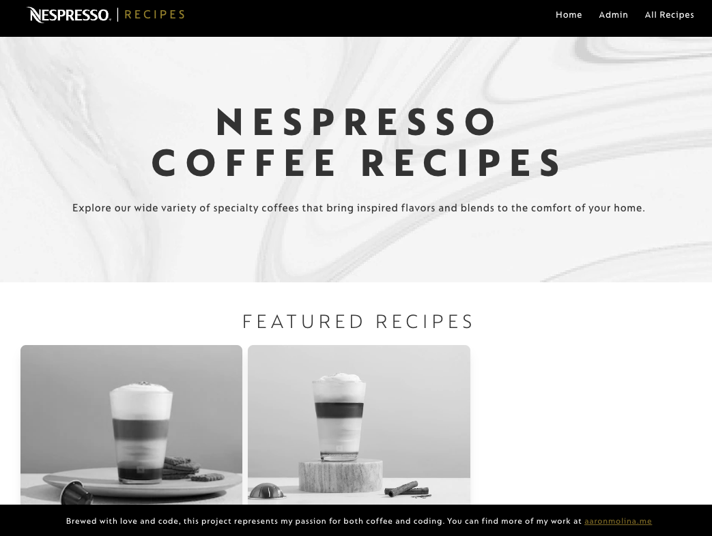

# nespresso-react-parcel-tailwind-app

This is a boilerplate for a React app using Parcel and Tailwind CSS. It uses the Parcel bundler instead of Webpack, and the Tailwind CSS framework instead of Bootstrap. This app is a work in progress.

## How to use this app

To use this app, clone the repo and run `npm install` to install the dependencies. Then run `npm start` to start the app. The app will be available at `http://localhost:1234`.

## Tech stack

This app was built with React, Parcel, and Tailwind CSS. I chose Parcel because it's simpler to use than Webpack, and I chose Tailwind CSS because it's more customizable than Bootstrap.

## Process

This is a custom built web application and everything was created from scratch. Theres been a few challenges that I managed to overcome while building this Full-stack application.

## Challenges

### Enhancing Parcel Bundling for Dynamic Images in React

ParcelJS is a powerful bundler that I've used seamlessly with React in the past. However, when I attempted to integrate it with dynamic images, I encountered a challenge.

Parcel follows a strict policy of bundling only those dependencies that are explicitly referenced in the code. This approach, while efficient, posed a problem for dynamic images. Since Parcel operates independently from my web app, it lacks knowledge of variable values. Consequently, Parcel didn't include any of the dynamic images in the generated bundle, leading to broken image source links.

#### Crafting a Solution

To overcome this obstacle, I devised a simple yet effective solution. I decided to include all images from the `/public/images/` directory in my project. These images would become a part of the final bundle.

But there was a twist! To ensure that these images could be correctly referenced in the outputted bundle, I used a custom utility function called `flattenImages()`. This utility function not only imported all the images from the `/public/images/` directory but also updated their names by prefixing them with the directory name to which they belonged. This clever approach allowed me to retrieve the correct image relative to the real path of the images where they're being stored.

#### Leveraging the `useImageHelper()` Hook

One of the key components of this solution was the `getImage()` function provided by the `useImageHelper()` hook. This function enabled me to effortlessly retrieve the absolute path to an image within the outputted bundle, even when dealing with dynamic images and the modified naming scheme. It ensured that the dynamic images were correctly sourced and displayed in my React application.

In the end, I managed to make ParcelJS play nicely with my React project. I created a custom solution for dynamic images using react context and react hooks with a helpful util function [flattenImages()](https://github.com/aaronm-git/nespresso-react-parcel-tailwind-app/blob/671bf34837e2739d19ac84cd486e07121f3dede9/src/utils/flattenImages.js) to keep things in order. The result? I got to keep Parcel's bundling magic while making sure my image links were all good.

### Creating my own flex grid components, based on bootstrap

This component can be seen in action from the Admin page at [https://aaronmolina.me/nespresso-parcel-tailwind-app/#/admin](https://aaronmolina.me/nespresso-parcel-tailwind-app/#/admin).

The challenge was that, when using `flex`, `flex-wrap`, and `gap-2` classes, even if the width of the child components would fit in a single row because of their even width size, the `gap` class would force the children to wrap to the next row.

I could have used CSS grid (`grid`) to help achieve my desired outcome, but I wanted to make it work just like Bootstrap. So, I did some digging in [Tailwind's docs](https://tailwindcss.com/docs/space#limitations) and found a solution.

I used `-space-x-*` classes, where `*` represents the amount of horizontal padding space applied to the children. This ensured that each child did not visually start or end with padding applied, resolving the issue and achieving the desired outcome.

### Creating my own component library for Skeletons (loading components)

These components can be seen in action from every page there's data being loaded, such as API calls.

I wanted to create a component that would display a loading skeleton for a component that was not yet ready to display its data. I wanted to create my own component library for this, instead of using a library such as `react-loading-skeleton`

### Created a scrapper using Python to scrape Nespresso.com to get all the data

Using Python, I wrote a scrapper script to get all the data around Nespresso recipes, including images, pod information, etc. This was a challenge because this was my first exposure to Python3. I have actually grown to really like using Python thanks to this project and I will definitely implement more Python with my apps.

## Future plans
I want people to be able to create their own recipes and be able to manage their recipes in the app and build a community of coffee lovers all around Nespresso products.